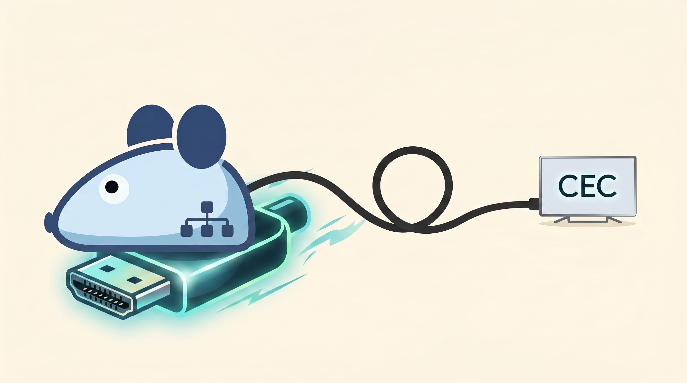
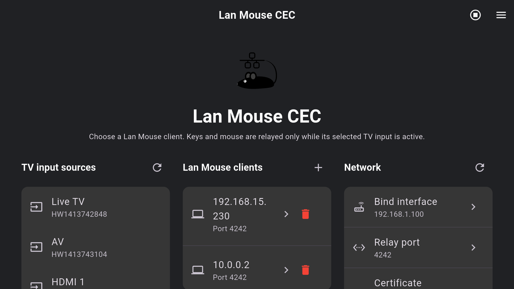
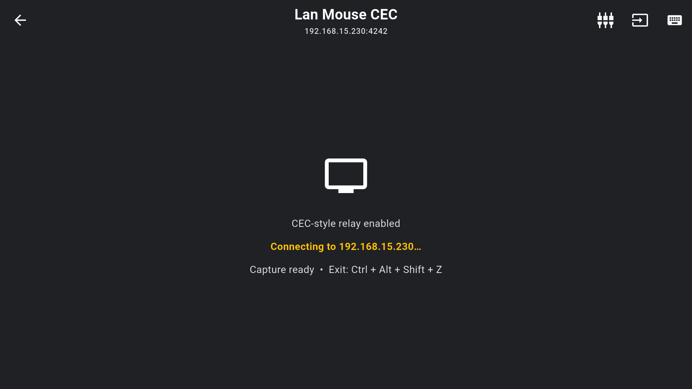

#  Lan Mouse TV CEC

An Android TV client for the stock [Lan Mouse](https://github.com/feschber/lan-mouse)
desktop receiver. It relays selected physical keyboard and mouse devices to
one Lan Mouse desktop only while a chosen TV input is active, creating a
CEC-style experience without modifying the desktop receiver.

This project is a GPL-3.0 derivative of
[Lan Mouse Mobile](https://github.com/rohitsangwan01/lan-mouse-mobile).

## TV interface

The Android TV home screen keeps connection, TV-input, and capture controls
available from the D-pad. Profiles provide a separate, focused relay setup for
each Lan Mouse client.

<p align="center">
  
</p>

<p align="center">
  
</p>


- Shizuku-backed native evdev capture with exclusive `EVIOCGRAB`.
- Explicit, safe USB keyboard and mouse device selection.
- Live TV, AV, and HDMI discovery through Android's TV Input Framework
  (`dumpsys tv_input`).
- One profile per saved Lan Mouse client, with its own TV-input trigger and
  capture-device selection. Only one relay connection is active at a time.
- TCL source-change broadcasts as the primary gate; opt-in command fallback
  and source-ID overlay for non-TCL TVs.
- Relative mouse movement, high-resolution scrolling, raw-event diagnostics,
  and a Ctrl+Alt+Shift+Z capture-release chord.

## Capture architecture

The app does **not** use `/system/bin/getevent` as its event relay. At capture
start, Shizuku launches the bundled native `input_grab_bridge` helper with the
user-selected `/dev/input/event*` devices. The helper opens those evdev nodes,
uses `EVIOCGRAB` to prevent Android from acting on their input, and streams
the raw events to the Android service. The service maps them to Lan Mouse input
events and forwards them to the connected desktop receiver.

`getevent -il` is retained only for three non-relay tasks:

- populating the capture-device selector;
- resolving a saved device name after an input device receives a new
  `/dev/input/eventN` number; and
- manual ADB diagnostics.

Capture is fail-closed: the native helper is started only when the active TV
source matches the profile's trigger, and it is stopped (releasing its grabs)
when the source changes away or the relay is stopped.

### Release and resume with Ctrl+Alt+Shift+Z

Pressing **Ctrl+Alt+Shift+Z** does not stop the foreground relay service or
disconnect the Lan Mouse client. It immediately stops the native helper and
releases `EVIOCGRAB`, allowing the selected keyboard/mouse to control Android
again. Capture then remains suspended while the trigger source is still shown.

To resume automatically, switch away from the profile's trigger input, then
switch back to it. The source transition clears the suspension and starts a
new native bridge. To end the relay entirely, use **End capture** in the home
screen toolbar.

## Requirements

- Rooted Android TV with Shizuku running and permission granted to this app.
- A Lan Mouse desktop receiver on the same network.
- ARMv7 support for the included build instructions (validated on a TCL
  QM850G running Android 11).

## Configure the relay

1. Add the TV's LAN address as a Lan Mouse client on the desktop receiver and
   authorize the fingerprint shown by this app.
2. Open **TV input sources** on the home screen and discover the TV Input
   Framework catalog.
3. Add or select a Lan Mouse client.
4. In the relay screen, select the profile's trigger input and safe USB
   devices under **CEC capture devices**.
5. Start capture. While the selected TV input is active, the helper exclusively
   captures only the chosen devices and forwards their input after the desktop
   client acknowledges the connection.

The **Network** card only permits binding to an IPv4 address currently assigned
to the TV. The relay validates the bind address and port before connecting.

## Build and install

From PowerShell at the repository root, build the native helper first, then the
APK:

```powershell
$env:PATH = "$env:USERPROFILE\.cargo\bin;C:\path\to\flutter\bin;" + $env:PATH
flutter pub get
flutter_rust_bridge_codegen generate --config-file flutter_rust_bridge.yaml

Push-Location rust
cargo ndk -t armeabi-v7a -t arm64-v8a -t x86_64 -o ..\android\app\src\main\jniLibs build --release
Pop-Location

flutter build apk --release --target-platform android-arm
```

For a universal release, replace the final build command with
`flutter build apk --release --target-platform android-arm,android-arm64,android-x64`.

Install and launch:

```powershell
$adb = "$env:LOCALAPPDATA\Android\Sdk\platform-tools\adb.exe"
& $adb -s <TV-IP>:5555 install -r build\app\outputs\flutter-apk\app-release.apk
& $adb -s <TV-IP>:5555 shell am start -S -f 0x10008000 -n com.rohit.lan_mouse_mobile/.MainActivity
```

Use the explicit `am start` command, not `monkey`, after an update.

## Troubleshooting

| Need | Command |
| --- | --- |
| Relay state, source changes, and bridge errors | `& $adb -s <TV-IP>:5555 logcat -s TvInputRelay` |
| Discovered TV input IDs | `& $adb -s <TV-IP>:5555 shell dumpsys tv_input` |
| Input-device names and capabilities | `& $adb -s <TV-IP>:5555 shell getevent -il` |

`getevent -il` is for device inspection only; use `logcat` to confirm the
native bridge started. Enable verbose logging only while mapping devices.

## Safety

Exclusively grab only devices you explicitly select. Never select the TCL IR
receiver, TV keypad, power, sleep, wake, restart, or screen-lock inputs. The
app filters safety-critical keys. **Ctrl+Alt+Shift+Z** releases capture only;
it does not stop the relay service.

## License

[GNU General Public License v3.0](LICENSE).
